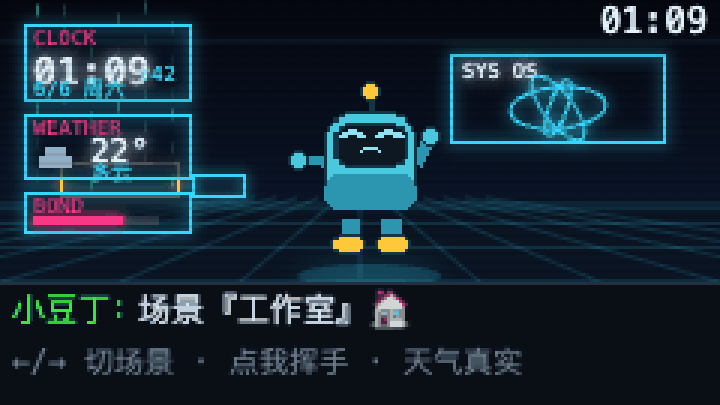

# 小豆丁 · xiaodouding

[English](README.md) · **中文** · ▶ [**在浏览器里直接玩**](https://huaspirit123.github.io/xiaodouding/)

**一只跑在 M5Stack Cardputer 上的、由大语言模型驱动的像素电子宠物。** 它能跟你聊天(带持久记忆)、
用语音回你话,还会自己过日子——在一个全息「像素工作台」里溜达,横跨 10 个昼夜场景,屏幕上显示
真实时间、真实天气和 WiFi 信号,还会根据你说的话做出不同情绪反应。

[](https://huaspirit123.github.io/xiaodouding/)

> ▶ **[在浏览器里直接玩 →](https://huaspirit123.github.io/xiaodouding/)** — 宠物自己漫游、真实时钟和天气,免安装。(聊天需要本地后端。)

> 内置角色是 **Pixel Buddy**,一个原创的通用吉祥物。想换成你自己的角色?
> 见 [精灵 / 自带角色](#精灵--自带角色)。

---

## ✨ 功能

- **真对话 + 记忆**——大脑是大语言模型(默认 DeepSeek,任何 OpenAI 兼容接口都行),跑在你电脑上。
  三层记忆:短期对话 + 滚动摘要 + 关于你的事实。回复会带一个「情绪」,驱动屏幕上的动画。
- **语音**——按住一个键说话(流式语音转文字),宠物用语音回你(语音合成),全部设备直连
  阿里云 DashScope。按住说话最长约 1 分钟。
- **闲着也有生命力**——它会四处走动、按作息做事(工作 / 吃饭 / 睡觉……),而且思考和说话都放在
  ESP32-S3 的**第二个 CPU 核**上跑,所以界面永不卡顿。
- **10 个场景,统一风格**——「像素全息工作台」:深蓝蓝图网格 + 霓虹辉光 + 锐利像素。室内
  (工作室/客厅/卧室)按作息自动切换;室外(高楼大厦/沙漠/草原/海洋/雪山/森林/太空)手动切换。
- **屏幕显示真实信息**——实时时钟和日期(NTP)、**真实天气**(设备直拉
  [open-meteo](https://open-meteo.com),按 IP 自动定位)、WiFi 信号格、亲密度条。
- **长文翻页**、音量调节、语音开关——全用 Cardputer 键盘操作。

## 🧰 硬件

- **M5Stack Cardputer(原版 / StampS3,ESP32-S3FN8)**——8MB flash,**无 PSRAM**。
- **microSD 卡**可选但推荐(精灵可从 SD 读;也是可选「多 app launcher」方案的前提)。
- 一台和设备**同一局域网**的电脑,用来跑后端「大脑」。

## 🏗 架构

```
 ┌──────────────┐   WiFi/局域网  ┌─────────────────────┐   HTTPS    ┌────────────┐
 │  Cardputer   │  ───────────► │  后端 (Node/Express)            │  大语言模型  │
 │  固件        │  /chat        │  大脑 + 三层记忆      ──────────► │ (DeepSeek…) │
 │ (C++/PlatformIO)             │  data/<petId>.json  │           └────────────┘
 │              │  ◄─────────── │  回复 + 情绪         │
 └──────┬───────┘               └─────────────────────┘
        │  HTTPS(设备直连,语音 + 天气)
        ▼
   DashScope(语音 STT/TTS)   ·   open-meteo(天气)
```

- **为什么要后端?** 把 API key 留在你电脑上(不进设备),给记忆一个落脚处,换模型只改一处。
  大脑就是标准 OpenAI 风格的对话——改 `backend/src/config.js` 就能指向 DeepSeek、OpenAI 或本地 Ollama。
- **为什么语音/天气设备直连?** DashScope 和 open-meteo 从设备的干净 WiFi 可直达;只有对话大脑走你电脑。

## 📁 仓库结构

```
firmware/      ESP32-S3 固件(PlatformIO)。scenes.h = 10 场景渲染,main.cpp = 主程序。
backend/       Node/Express「大脑」:LLM 对话 + 记忆 + 语音代理。
sim/           浏览器「设备孪生」+ 场景预览器(调视觉用,极快)。
tools/         gen_sprites.py(生成通用吉祥物)+ pack_sprites.py(→ 设备格式)。
sprites_src/   内置吉祥物的源帧(可重新生成,或换成你自己的)。
```

## 🚀 快速上手

### 1. 后端(大脑)

```bash
cd backend
cp .env.example .env          # 填上 DEEPSEEK_API_KEY(要语音再填 DASHSCOPE_API_KEY)
npm install
npm start                     # 监听 http://0.0.0.0:8787
```

记下你电脑的局域网 IP(比如 `192.168.1.20`),待会儿要填进固件配置。

### 2. 精灵

内置的通用吉祥物已经生成好了;想重新生成或自定义:

```bash
pip install pillow
python tools/gen_sprites.py   # → sprites_src/(原创的 Pixel Buddy)
python tools/pack_sprites.py  # → firmware/data/sprites/*.bin + firmware/src/sprites_meta.h
```

### 3. 固件

```bash
cd firmware
cp src/config.h.example src/config.h     # 设置 WiFi、BACKEND_URL(你的局域网 IP)、DashScope key
pio run -t upload                        # 编译 + 烧录(PlatformIO)
pio run -t uploadfs                      # 把精灵传到设备 LittleFS
```

开机:打字按 **Enter** 聊天。(控制键见下。)

## 🎮 控制键(Cardputer 键盘)

| 按键 | 作用 |
|-----|--------|
| 打字 + `Enter` | 发送一条消息 |
| 按住 `Opt` | 按住说话:说完松开发送 |
| `Fn` + `,` / `.` | 长回复上 / 下翻页 |
| `Fn` + `[` / `]` | 上一个 / 下一个场景 |
| `Fn` + `\` | 场景恢复跟随作息自动切 |
| `Fn` + `/` | 循环切换音量 |
| `Fn` + `V` | 语音回复开 / 关 |
| `Fn` + `1`…`0` | 触发各种动作动画 |

## 🎨 精灵 / 自带角色

设备播放每个动作的精灵序列帧(64×72)。内置的 **Pixel Buddy** 是原创程序化美术。想用你自己的角色:

1. 把你的帧放到 `sprites_src/frames/<动作>/<动作>_<序号>.png`(RGBA,64×72),再配一个
   `sprites_src/metadata.json`(格式和动作名参考生成出来的那份;共 34 个动作)。
   小技巧:用 AI 生成一套精灵图,或自己画——保持动作名一致即可。
2. `python tools/pack_sprites.py` → 重新打包成设备格式。
3. `pio run -t uploadfs`(或把 `firmware/data/sprites/` 拷到 SD 卡根目录 `/sprites/`)。

> ⚠️ 请不要把有版权/商标的角色提交到本仓库,那些留在你本地就好。

## 🔊 语音 & 🌤 天气

语音(STT + TTS)和天气都是可选的、设备直连。把 `DASHSCOPE_API_KEY` 留空就关掉语音(文字聊天照常)。
天气通过 open-meteo 按 IP 自动定位(免 key);想固定城市改 `firmware/src/weather.h` 里的经纬度。

## 🧩 可选:和其他 app 共存(launcher)

想要「手机式」体验——宠物是众多 app 之一、可以来回切换?烧录
[bmorcelli/Launcher](https://github.com/bmorcelli/Launcher)(用它的网页烧录器,选
*M5Stack → Cardputer*),把 `firmware/.pio/build/cardputer/firmware.bin` 拷到 SD 卡,在
launcher 的 SD 菜单里安装。宠物里按 `Fn+Q` 返回 launcher。这种模式下精灵必须放在 SD 卡上
(固件首次开机会自动迁移过去)。

## 🛠 技术要点(踩过的坑)

- **无 PSRAM**(约 300KB 堆):只用一张全屏画布,精灵按动作流式读取;TLS 很吃栈,所以加大了
  loop 任务栈,并把对话/语音放到**第二个核**上跑。
- **半双工音频**:麦克风和扬声器共用引脚——固件在两者间切换,每次切换前后复位相关 GPIO。
- **流式语音识别** 走 WebSocket(paraformer-realtime),所以一分钟的话也不用整段缓存。
- `sim/` 浏览器孪生渲染的是同一套场景——在那里调视觉(快),再移植到 `scenes.h`。

## 🤝 参与贡献

欢迎 PR——见 [CONTRIBUTING.md](CONTRIBUTING.md)。适合上手的:更多场景、更精致的吉祥物美术、
更多 LLM/语音后端、设备端文案的英文/国际化。

## 📜 许可证

[Apache-2.0](LICENSE)。内置的 **Pixel Buddy** 美术是原创的,同样以 Apache-2.0 授权。

## 🙏 致谢 & 声明

- LLM:[DeepSeek](https://deepseek.com)(默认,可换)。语音:阿里云
  [DashScope](https://dashscope.console.aliyun.com)(Qwen ASR/TTS)。天气:
  [open-meteo](https://open-meteo.com)。硬件:[M5Stack Cardputer](https://m5stack.com)。
- 与上述各方均无隶属/背书关系。请自备 API key。
